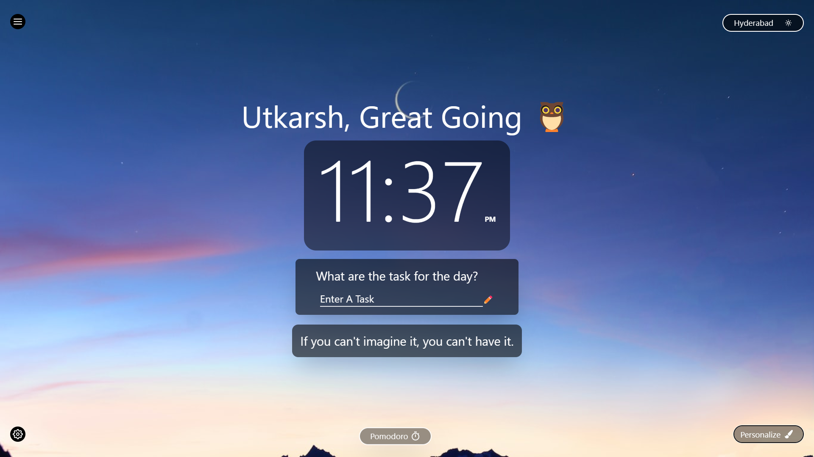
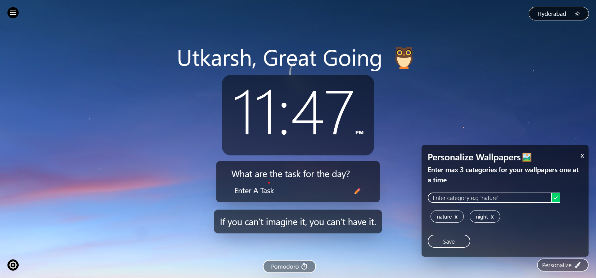
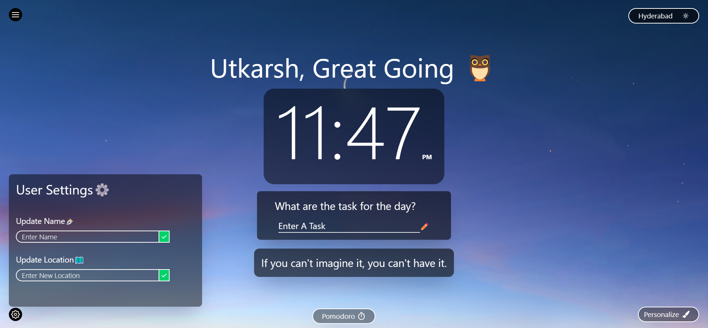
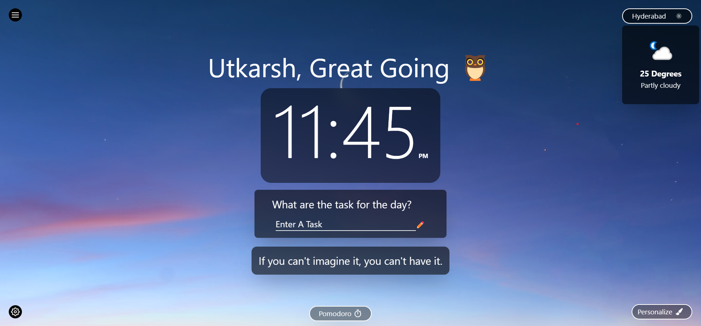
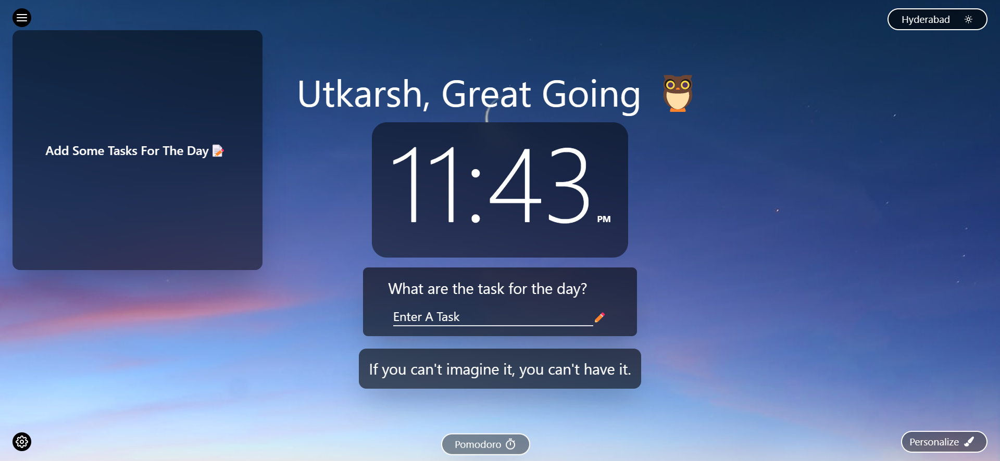
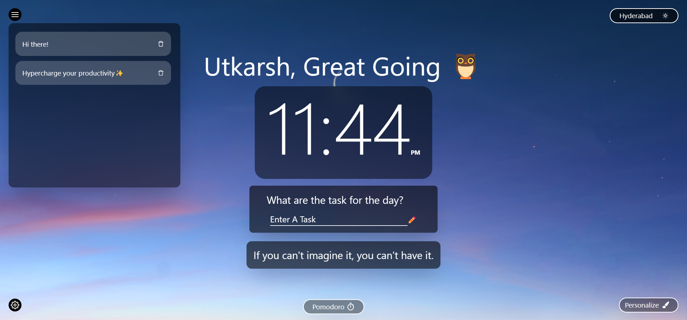
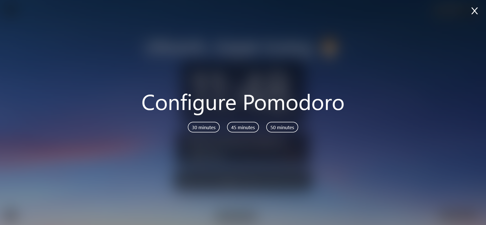
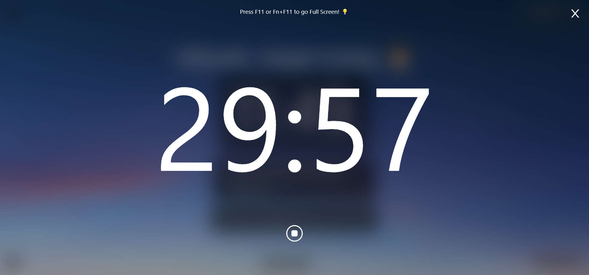

# The Minimilistic Open Source Dashboard💜

I developed this app/chrome extension as a side project because I was fascinated with the chrome extension "Momentum" and I wanted to test out my skills to see if I would be able to make something that I can use in my daily life and Viola after a week and a lot stack overflow, here's what I came up with😄.

This current version is the basic version of the app with the basic features like to-do, greetings, weather and customizeable background images. I'll be working on making it the best free dashboard available. If you are a fellow developer, I'd love any contributions that you'd provide to this repository, for the main goal of this dashboard is promoting Open Source🥳

  <h1>Screens Built</h1>
  
I'll Be Adding More As I Complete Them😄

   
  

    
    
    
  

    
  

    
    
    
  

    
  

    
    
  

## Technologies Used

* ReactJS - For frontend
* UseContextAPI - State management
* UnsplashAPI - For background images
* Free Weather API - For real time weather
* TailwindCSS - For styling the app
* Local storage - Used as a database
* A Hell Load Of Coffee☕ - What every programmer needs to stay awake😎

## Setting Up The App

If you want a quick preview of the app you can directly visit this [link](https://open-dashboard.vercel.app/)

### To use the chrome extension

* Download the zipped build from the releases folder
* Extract the file, you'll land up with a build folder
* Go to chrome -> extensions -> developer mode -> add unpacked
* Select the build folder and add it
* Open a new tab and see your very own dashboard😄

### To setup the app in local system

* Fork the repository
* Clone the repository to your local system
* run `npm i` to install the dependencies
* After all the dependencies are installed, run `npm start` to launch the development server
* Boom, your app is ready at `localhost:3000` show your creativity to customize the dashboard as you wish😄

#### All pull requests to better the app are welcome, let's create a dashboard for everyone together with the power of open source🤟🏻
